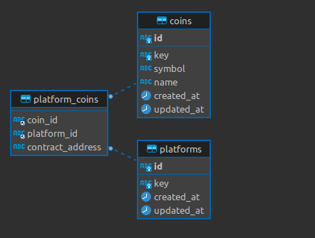

# trial_gabriele
Trial task for Gabriele Del Mese

# Installation
1. Clone project.
2. Navigate to project directory.
3. Create .env file: ```cp .env.example .env```.
4. Run composer install: ```composer install```.
5. Run migrations: ```php artisan migrate```.

# Fetching coins list from CoinGecko
There are two ways to execute command:
``` 
// Retrieve coins without platform contract addresses
php artisan coin-gecko:get-coins

// Retrieve coins including platform contract addresses
php artisan coin-gecko:get-coins --include-platforms
```

This command will get list of all coins from CoinGecko API and store it to database.

# Database schema

